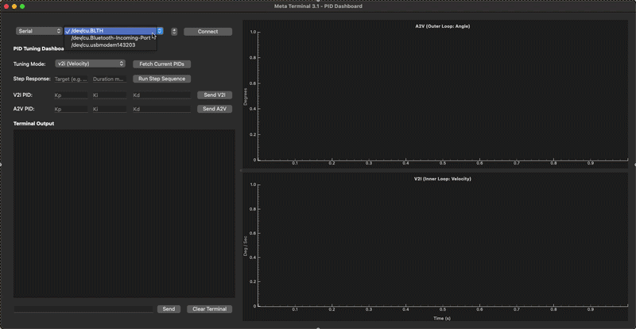

# Meta Terminal 3.1 - PID Tuning Dashboard

Forked from [Meta Terminal III](https://github.com/Meta-Team/Meta-Terminal-III), Meta Terminal 3.1 has been entirely re-architected into a professional-grade, dual-loop PID tuning dashboard. It is designed specifically for live embedded motor control tuning, featuring synchronized real-time plotting for cascaded Angle (Outer) and Velocity (Inner) loops, automated step-response generation, and hardware-safe parameter injection.

## Demo

## Requirements

- Python 3.6+
- PyQt5
- pyqtgraph
- numpy
- pyserial

## Integration with `ut_pid_tuning` (meta-embedded)

This application serves as the host-side visualizer and command center for the `ut_pid_tuning.cpp` unit test firmware within the `meta-embedded` (ChibiOS/STM32) repository. 

### How it Works Together
The dashboard communicates with the STM32 via a hardware Serial/UART connection using the custom `Meta Shell` protocol. It is specifically designed to tune **Cascaded PID Loops** safely and efficiently:

1. **State Synchronization:** Clicking **"Fetch Current PIDs"** sends the `tune get` command to the STM32, which locks the hardware UART Mutex and returns the active boot parameters for both the Angle (`a2v`) and Velocity (`v2i`) control loops.
2. **Automated Step Responses:** The **"Run Step Sequence"** button triggers a 5-stage state machine on the STM32 (`IDLE` -> `PRE_ZERO` -> `STEP_POS` -> `STEP_NEG` -> `POST_ZERO`). The firmware automatically handles the timing and begins streaming high-frequency telemetry.
3. **Synchronized Dual-Plotting:** The STM32 streams four data points per cycle (`Target Angle`, `Actual Angle`, `Target Velocity`, `Actual Velocity`). To prevent GUI lockups and visual tearing, the Python terminal buffers the serial lines and only flushes the data to the UI when a complete, synchronized 4-part frame is received. The axes of the two plots are mathematically linked for perfect visual comparison.
4. **Buffer-Safe Injection:** When sending new PID parameters, the GUI utilizes a queued asynchronous delay (150ms) to feed commands to the STM32 one by one. This prevents hardware buffer overflows on the serial converter and ensures the active `skdThread` safely absorbs the new control parameters via `load_PID_params()`.

### Recommended Tuning Workflow
When paired with the `meta-embedded` firmware, follow the standard robotics cascaded tuning procedure:
1. Set Tuning Mode to **v2i (Velocity)**.
2. Tune the Inner Loop (Velocity) using P, I, and D until the step response is sharp and dampen the ringing.
3. Switch Tuning Mode to **a2v (Angle)**.
4. Tune the Outer Loop (Angle) using **P-only** (Kp). If the motor begins to oscillate, either lower the Angle Kp or return to the Velocity loop to make it stiffer.

## File Overview

- `main.py`: The main entry point of the application. Sets up the GUI and handles user interactions.
- `device.py`: Manages device connections and communication, utilizing `pyserial` for robust buffer flushing.
- `chart_widget.py`: Manages the layout container for the plotting widgets, enforcing edge-to-edge UI expansion.
- `graph.py`: Handles the underlying dual-plot architecture via `pyqtgraph`, enforcing dark mode styling, MATLAB color profiles, and X-axis synchronization.